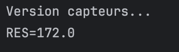

# TP-IOC

## Architecture du Projet

Le projet suit une architecture classique en couches :

```
📁 Couche DAO (Accès aux Données)
├── IDao.java (interface)
├── DaoImpl.java (version base de données)
└── DaoImplV2.java (version capteurs)

📁 Couche Métier (Business)
├── IMetier.java (interface)
└── MetierImpl.java (logique de calcul)

📁 Couche Présentation
├── Presentation1.java (instanciation directe)
├── Presentation2.java (IOC basé sur la réflexion)
├── PresentationSpringXML.java (config Spring XML)
└── PresentationSpringAnnotation.java (annotations Spring)
```

### Version Capteurs (DaoImplV2.java)

```java
public double getData() {
    System.out.println("Version capteurs...");
    return 12.0; // Données simulées de capteurs
}
```

## Captures d'Écran des Résultats

### Version de la base de données


### Version des capteurs


